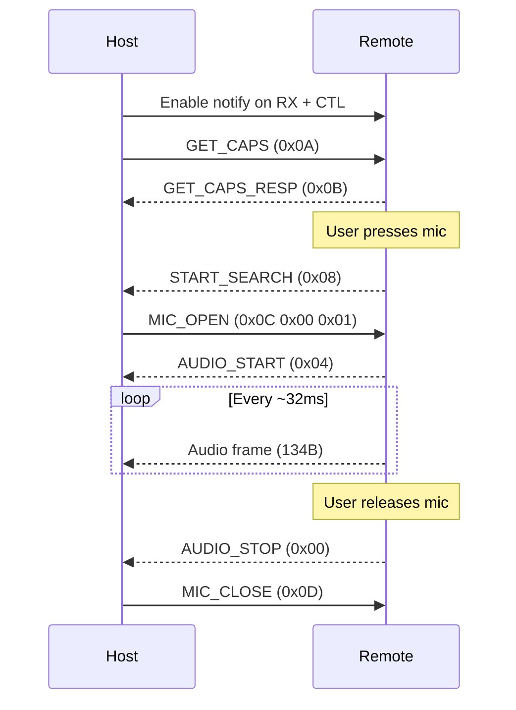
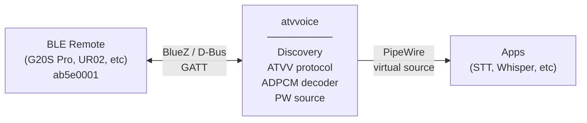
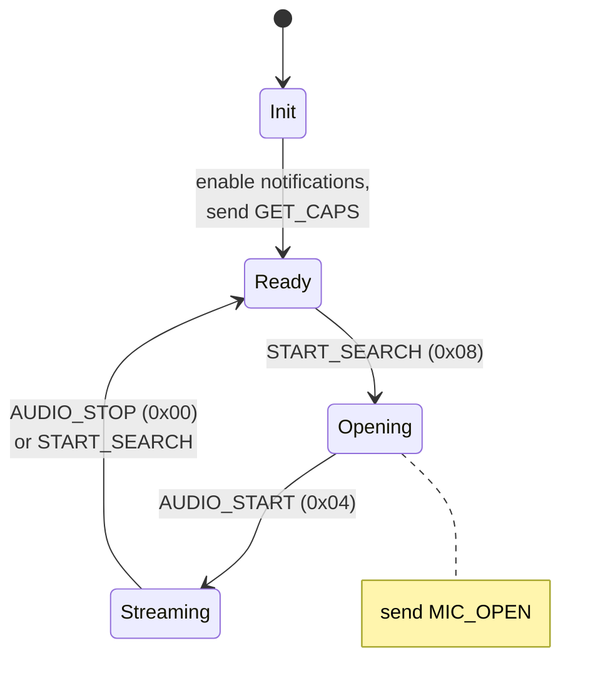

# atvvoice — Design Spec

**Google ATV Voice over BLE daemon for Linux/PipeWire**

A Rust userspace daemon that discovers BLE remotes advertising the ATVV service,
handles the voice protocol handshake, decodes IMA/DVI ADPCM audio in real-time,
and exposes it as a PipeWire virtual microphone source.

## Background

Google TV voice remotes (G20S Pro, UR02, and many clones following the Google
Reference Design) have built-in microphones that stream audio over BLE using a
proprietary protocol called "Google Voice over BLE" (ATVV). The protocol uses a
custom GATT service (`AB5E0001-5A21-4F05-BC7D-AF01F617B664`).

On Android TV, Google's closed-source Katniss framework handles this protocol.
On Linux, there is no support — BlueZ sees the HID profile (keyboard/mouse) but
ignores the voice service entirely. This daemon fills that gap.

### Related Work

- [BlueZ issue #1086](https://github.com/bluez/bluez/issues/1086) — open request for Linux support
- [Infineon CYW20829 Voice Remote](https://github.com/Infineon/mtb-example-btstack-freertos-cyw20829-voice-remote) — reference firmware implementation (source of truth for frame format)
- `hid-atv-remote.c` — Android kernel driver for older VoHoGP remotes (not applicable; ATVV uses GATT, not HID reports)

## ATVV Protocol

### GATT Service

| Characteristic | UUID | Direction | Purpose |
|---|---|---|---|
| ATVV_CHAR_TX | `AB5E0002` | Host → Remote | Commands (write without response) |
| ATVV_CHAR_RX | `AB5E0003` | Remote → Host | Audio data (notify) |
| ATVV_CHAR_CTL | `AB5E0004` | Remote → Host | Control signals (notify) |

### Command Table

| Command | Byte(s) | Characteristic | Direction |
|---|---|---|---|
| GET_CAPS | `0x0A` + version(2 BE) + codecs(2 BE) | TX | Host → Remote |
| MIC_OPEN | `0x0C` + codec(2 BE) | TX | Host → Remote |
| MIC_CLOSE | `0x0D` | TX | Host → Remote |
| GET_CAPS_RESP | `0x0B` + version(2) + codecs(2) + bpf(2) + bpc(2) | CTL | Remote → Host |
| START_SEARCH | `0x08` | CTL | Remote → Host |
| AUDIO_START | `0x04` | CTL | Remote → Host |
| AUDIO_STOP | `0x00` | CTL | Remote → Host |

### Session Flow



Note: some remotes send a second START_SEARCH instead of AUDIO_STOP when the
mic button is toggled. The daemon must handle both patterns.

### Audio Frame Format (134 bytes)

```
┌──────────────┬───────┬──────────────┬───────────┬──────────────────┐
│ SeqID (BE)   │ 0x00  │ Predictor BE │ StepIndex │ 128B ADPCM data  │
│ 2 bytes      │ 1B    │ 2 bytes      │ 1 byte    │ high nibble first│
├──────────────┴───────┼──────────────┴───────────┼──────────────────┤
│   App header (3B)    │    DVI header (3B)       │  256 samples     │
└──────────────────────┴──────────────────────────┴──────────────────┘
```

- **Bytes 0–1**: Sequence number (big-endian, monotonically increasing).
  On gap detection (missing seq), log a warning and continue — do not
  attempt interpolation.
- **Byte 2**: Always `0x00` (padding/reserved)
- **Bytes 3–4**: DVI predictor value (big-endian, signed 16-bit)
- **Byte 5**: DVI step table index (0–88)
- **Bytes 6–133**: 128 bytes of IMA/DVI ADPCM nibbles (high nibble decoded first)

Each frame is independently decodable — the decoder resets predictor and
step_index from the DVI header at the start of each frame.

### Codec

Standard IMA/DVI ADPCM (Intel 1992 spec):
- 4 bits per sample, 4:1 compression
- 89-entry step table, 8-entry index table
- Nibble format: bit 3 = sign, bits 2–0 = magnitude
- 256 samples per frame at 8kHz = 32ms per frame ≈ 30.8 fps

## Architecture



### Components

#### 1. BLE Discovery & Connection (`ble.rs`)

Uses the `bluer` crate (async BlueZ D-Bus bindings).

Responsibilities:
- Monitor bonded devices for the ATVV service UUID
- Track connect/disconnect events
- Resolve GATT characteristic handles for TX, RX, CTL
- Provide async streams for GATT notifications

Does NOT handle pairing — assumes device is already bonded via `bluetoothctl`.

On BLE disconnect, re-enters discovery and waits for the device to reconnect.
Most BLE remotes auto-reconnect when a button is pressed. The daemon does not
need to restart — it monitors BlueZ device property changes and re-initializes
the ATVV session when the device reconnects.

#### 2. ATVV Protocol State Machine (`atvv.rs`)

Manages the ATVV session lifecycle:



Receives CTL notifications, sends TX commands, dispatches audio frames to the
decoder.

#### 3. ADPCM Decoder (`adpcm.rs`)

Pure, stateless frame decoder:

```rust
fn decode_frame(frame: &[u8; 134]) -> [i16; 257]
```

- Parses 6-byte header (3 app + 3 DVI)
- Resets predictor and step_index from DVI header per frame
- Returns 257 samples: the initial predictor value as sample 0, followed by
  256 decoded samples. All 257 are pushed through the pipeline — the predictor
  IS a valid audio sample (the encoder's output at the frame boundary).
- Standard IMA step/index tables

Post-processing (applied after decode):
- Single-sample click removal (interpolate spikes where both neighbors disagree)
- 3-tap triangle low-pass filter `[0.25, 0.5, 0.25]`

#### 4. PipeWire Source (`pw.rs`)

Creates a PipeWire audio source node using `pipewire-rs`:
- Format: 8kHz, mono, s16le
- Node properties: `media.class = "Audio/Source"`, descriptive name
- Pushes decoded PCM buffers on each frame notification
- The node appears as a microphone in pavucontrol, GNOME Settings, etc.
- When not streaming, the node produces silence (or is removed)

#### 5. Main / CLI (`main.rs`)

```
atvvoice [OPTIONS]

Options:
  -d, --device <ADDR>    Filter by BT address (default: first ATVV device found)
  -a, --adapter <NAME>   BlueZ adapter (default: auto-detect)
  -v, --verbose           Increase log verbosity
  -g, --gain <DB>         Audio gain in dB (default: 20dB, ~10x amplification).
                          The remote mic produces very low-level output; 20dB
                          is a reasonable default. Set to 0 for raw output.
```

- Runs as foreground daemon (systemd manages lifecycle)
- Tokio async runtime
- Graceful shutdown on SIGTERM/SIGINT (sends MIC_CLOSE, destroys PW node)

## Audio Pipeline

```
BLE notification (134B)
  → parse 6-byte header
  → reset decoder (predictor, step_index)
  → decode 128 ADPCM bytes → 257 PCM samples
  → click removal (interpolate single-sample spikes)
  → low-pass filter (3-tap triangle)
  → gain normalization
  → push to PipeWire buffer
```

Latency budget: ~32ms per frame (frame duration) + PipeWire buffer (~10ms)
≈ 42ms total mic-to-app latency.

## Packaging

### Cargo / Crate Structure

```
atvvoice/
├── Cargo.toml
├── flake.nix          # Nix flake with package + NixOS/HM module
├── src/
│   ├── main.rs
│   ├── ble.rs
│   ├── atvv.rs
│   ├── adpcm.rs
│   └── pw.rs
└── docs/
    └── specs/
        └── 2026-03-23-atvvoice-design.md
```

### Dependencies

- `bluer` — async BlueZ D-Bus bindings
- `pipewire` — PipeWire client bindings
- `tokio` — async runtime
- `clap` — CLI argument parsing
- `tracing` / `tracing-subscriber` — structured logging

### Nix Module

The flake exports:
- `packages.default` — the `atvvoice` binary
- `homeManagerModules.default` — HM module with:
  - `services.atvvoice.enable`
  - `services.atvvoice.device` (optional BT address filter)
  - `services.atvvoice.gain` (optional gain in dB)
  - Systemd user service: `atvvoice.service`

## Non-Goals

- **Pairing/bonding** — use `bluetoothctl` manually
- **Multiple simultaneous remotes** — single device only (first discovered)
- **ALSA fallback** — PipeWire only
- **Opus codec** — ADPCM only (codec 0x0001); Opus support can be added later
- **16kHz mode** — 8kHz only (matching G20S Pro capabilities)
- **Android TV emulation** — this is a mic source, not a voice assistant

## Testing

- **Unit tests**: ADPCM decoder against known test vectors (encode→decode round-trip)
- **Integration test**: Mock BlueZ D-Bus interface, verify protocol state machine
- **Manual test**: Record audio, save WAV, verify quality matches Python prototype
